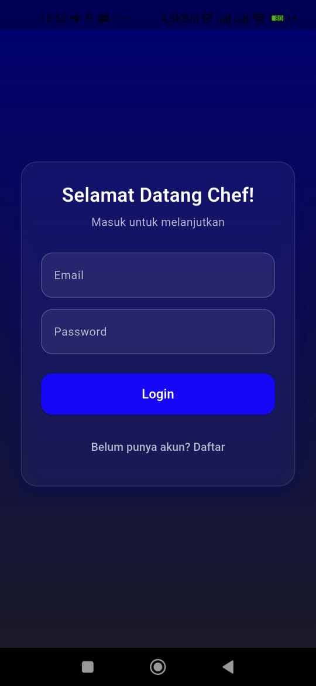
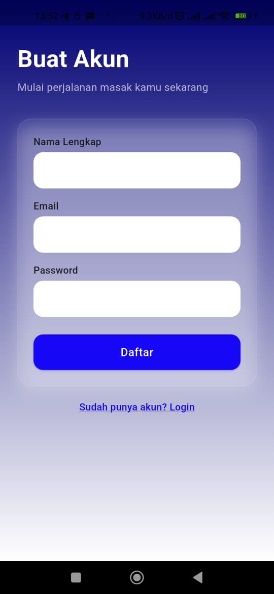
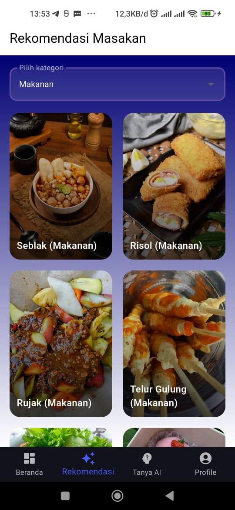
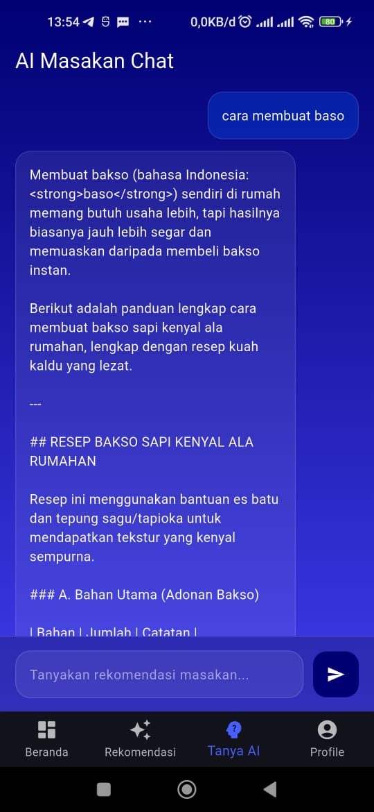
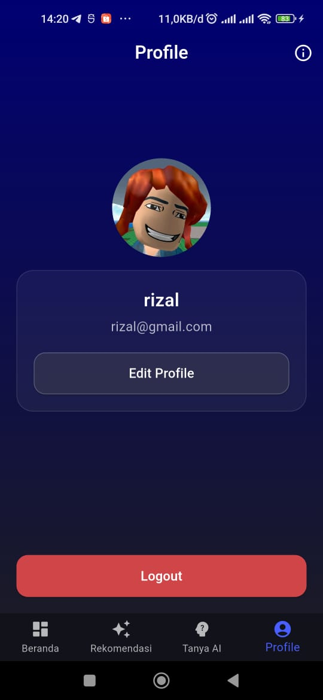
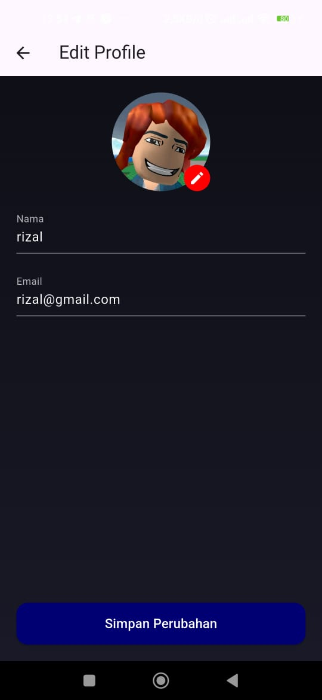

# uts_pemob_resep

MariMasak adalah aplikasi mobile bertema *Masak recommender* yang menggunakan *Google Gemini AI* untuk memberikan saran Masak, Makanan, Minuman, dan inspirasi Masakan lainnya.  
Aplikasi ini dibuat sebagai bagian dari *UTS Pemrograman Mobile 2*.

## Ada SplashScreen dengan logo aplikasi

##  Fitur Utama

### Login(SqlLite)
- User harus login terlebih dahulu untuk masuk aplikasi
- Jika tidak mempunyai akun maka harus register
- Login menggunakan database SQLite

### Register
- Jika user tidak mempunyai akun maka di haruskan register untuk membuat akun

###  Beranda
- Rekomendasi Masak harian
- Jenis Makanan (Makanan, minuman, pedas, manis, digin, panas.)
- Tombol cepat: *Tanya AI*

###  Rekomendasi Page
- Grid List Rekomendasi Masakan
- Ada fitur pilih Masakan untuk memilih Masakan sesuai kategoti (Makanan, minuman, pedas, manis, digin, panas)

###  Tanya AI (Gemini)
- Konsultasi Cara Masak ke AI
- Powered by *Google Gemini API*

###  Profile
- Menampilkan nama & email user
- About
- Tombol Logout

### ℹ About Page
-Untuk CopyRight

-----------||--------------------------------------------||---------------------||---------------
##  Screenshot Aplikasi

### Login Page 

 
### Reguster Page 

 

### Beranda  

 

### Rekomendasi  
  

### Tanya AI  
  

### Profile  
  
  

### About
  

## Data Diri
Nama : Rizal Abdul Ghani 
Nim : 23552011086 
Kelas : TIF RP 23 CID B 
